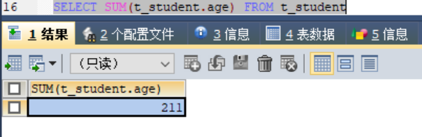
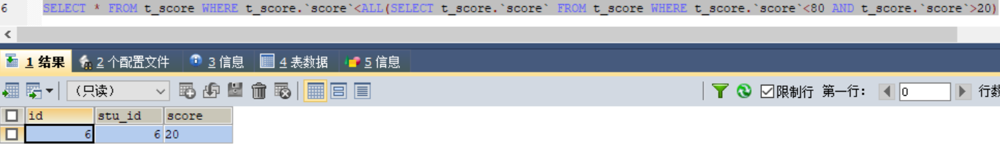
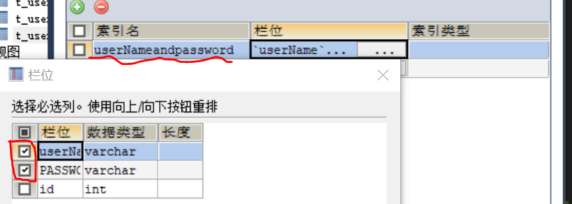

## 第一章 MySQL简介
* 1.1 MySQL简介
    * MySQL是一种关系型数据库管理系统，关系数据库将数据保存在不同的表中，而不是将所有数据放在一个大仓库内，这样就增加了速度并提高了灵活性。
* 1.2 MySQL安装与配置
* 1.3 sqlyog引入，非常方便，不用在命令提示符写一堆代码，可以直接在SQLyog创建并增删改查数据。

## 第二章 MySQL数据类型
* MySQL中定义数据字段的类型对数据库的优化是非常重要的。MySQL支持多种类型，大致可以分为三类：数值、日期/时间和字符串(字符)类型。
* 2.1 数值类型(整数类型、浮点数类型、定点数类型)
    * MySQL支持所有标准SQL数值数据类型。这些类型包括严格数值数据(整数)类型(INTEGER、SMALLINT、DECIMAL和NUMERIC)，以及近似数值数据(浮点数)类型(FLOAT、REAL和DOUBLE PRECISION)。
    * 关键字INT是INTEGER的同义词，关键词DEC是DECIMAL的同义词
    * 
* 2.2 日期类型、时间类型
    * 表示时间值的日期和事件的类型为DATETIME、DATE、TIMESTAMP、TIME和YEAR。每个时间类型有一个有效值范围和一个“零”值，当指定不合法的MySQL不能表示的值时使用“零”值。
        * 
    * TIMESTAMP类型有专有的自动更新特性。
* 2.3 字符串(字符)类型
    * 字符串类型指CHAR、VARCHAR、BINARY、VARBINARY、BLOB、TEXT、ENUM和SET。
    * CHAR 和 VARCHAR 类型相似，但保存和检索的方式不同，他们的最大长度和是否为不空格被保留等方面也不同，在存储或检索过程中不进行大小写转换，也就是存储的是大写，检索出来的肯定也是大写。
    * BINARY 和 VARBINARY 类似于 CHAR 和 VARCHAR，不同的是它们包含二进制字符串而不要非二进制字符串。也就是说，它们包含字节字符串而不是字符字符串。这说明它们没有字符集，并且排序和比较基于列值字节的数值。
    * BLOB 是一个二进制大对象，可以容纳可变数量的数据。有 4 种 BLOB 类型：TINYBLOB、BLOB、MEDIUMBLOB 和 LONGBLOB。它们区别在于可容纳存储范围不同。
    * TEXT类型有四种，TINYTEXT、TEXT、MEDIUMTEXT 和 LONGTEXT。对应的这 4 种 BLOB 类型，可存储的最大长度不同，可根据实际情况选择。常用的有TEXT和MEDIUMTEXT，TINYTEXT太小，LONGTEXT初学者用不到。
        * 

## 第三章 MySQL数据库和表的基本操作
* 3.1 数据库简介
    * 显而易见，就是存储数据的地方
* 3.2 数据库查看
    * 1. 首先，使用Win+R，cmd，```mysql -u root -p```，来连接数据库
    * 2. 其次，查看数据库的命令为 ```Show databases```
* 3.3 数据库创建
    * 创建数据库的命令 ```Create database db_test```。(格式要求：db->意为这是个数据库；test->数据库名)
* 3.4 数据库删除
    * 删除数据库命令 ```Drop database db_test```。

## 第四章 数据查询
* 4.1 单表查询
    * 1. 查询指定列，```SELECT t_student.name,t_student.age FROM t_student```
        * 
    * 2. 查询全部列，```SELECT * FROM t_student```
    * 3. 查询经过计算的值(想查询18岁以上的人)，```SELECT t_student.name,t_student.gender,t_student.age-10 FROM t_student```
        * 
    * 4. 消除取值重复的行，关键字为DISTINCT，```SELECT DISTINCT t_student.name FROM t_student```
        * 
    * 5. 查询满足条件的元祖(比较、确定范围、确定集合、字符匹配、空值、多重条件)
        * 
        * 
        * 
        * 
        * 空值，找一个值为空值的和不是空值的，关键字为第一个基础上```IS (NOT) NULL```
            * 
            * 
        * 
    * 6. Order by 子句(用来排序)
        * 
        * 
    * 7. 聚集函数
        * 
        * 
    * 8. Group by子句
        * 
* 4.2 连接查询
    * 1. 等值与非等值连接查询
        * 
    * 2. 自身连接
        * 
    * 3. 外连接
        * 左外连接，列出左边关系的所有元祖，我没能列出来，命令为```SELECT t_student.`name`,t_student.`age`,t_student.`gender`,t_score.`score` FROM t_score LEFT OUTER JOIN  t_student stu ON (t_score.`stu_id`=t_student.`id`)```
        * 右外连接，列出右边关系的所有元祖，命令为```SELECT t_student.`name`,t_student.`age`,t_student.`gender`,t_score.`score` FROM t_score RIGHT OUTER JOIN  t_student stu ON (t_score.`stu_id`=t_student.`id`)```
    * 4. 复合条件连接，查找score>90的学生，命令为```SELECT t_student.`name`,t_student.`age`,t_student.`gender`,t_score.`score` FROM t_score,t_student WHERE t_score.`stu_id`=t_student.`id` AND t_score.`score`>90```
        * 
* 4.3 嵌套查询
    * 1. 带有IN谓词的子查询
        * 
    * 2. 带有比较运算符的子查询
        * 
    * 3. 带有ANY(SOME)或者ALL谓词的子查询
        * 
        * 
    * 4. 带有EXISTS谓词的子查询，EXIST:代表存在量词，不会返回任何数据，只产生逻辑结果，就是true/false。其对应的反义谓词为 NOT EXIST，就是使用EXIST后返回什么，NOT EXIST就反着来。
        * 
        * 
* 4.4 集合查询
    * 1. UNION并集，列出符合age大于20的不管gender是否为男，并列出符合gender为男不管age是否大于20。
        * 
    * 2. INTERSECTS交集，MySQL中无法使用，也看不到运行结果，用到时再说，其实就是列出同时符合条件的数据。
        * ```SELECT * FROM t_student WHERE t_student.`age`>20 INTERSECTS SELECT * FROM t_student WHERE t_student.`gender`="男"```
    * 3. EXCEPT差集，就是列出符合条件的数据以外的数据，
* 4.5 SELECT语句的一般格式
    * ```
        SELECT[ALL|DISTINCT]<目标列表达式> [AS列名] [,<目标列表达式> [AS列名]...] 
        FROM <表明或视图名> [别名][,<表名或视图名>[别名]]... 
        WHERE <条件表达式> [AND|OR<条件表达式>...]
        [GROUP BY 列名[HAVING <条件表达式>]]
        [ORDER BY 列名[ASC|DESC]]
      ```

## 第五章 数据更新
* 5.1 插入数据，比较常用的是省略版和不想添加的数据写null版
    * 1. 普通插入，关键字为INTERT INTO ... VALUES ...
        * 
        * 
        * 
    * 2. 批量插入
        * 
* 5.2 修改数据，关键字为UPDATE ... SET ... (WHERE) ...
    * 
    * 
* 5.3 删除数据，关键字为DELETE FROM ... WHERE ...
    * 
    * 

## 第六章 索引
* 6.1 定义
    * 定义：索引是由数据库中一列或者多列组合而成，起作用时提高对表中数据的查询速度。
* 6.2 索引的优缺点
    * 优点：提高了查询数据的速度
    * 缺点：需要投入更多精力管理索引
* 6.3 索引的类别
    * 1. 普通索引，这类索引可以创建在任何数据类型中，VARCHAR,INT,BUBBLE中都可以创建。
        * 
    * 2. 唯一性索引，使用UNIQUE参数可以设置，再创建唯一性索引时，限制该索引的值必须是唯一的
        * 
    * 3. 全文索引，使用FULLTEXT参数可以设置，全文索引只能创建在CHAR,VARCHAR,TEXT类型的字段上，主要作用就是提高查询较大字符串类型的速度。但是MySQL引擎上默认不支持
    * 4. 单列索引，在表中可以给单个字段创建索引，单列索引可以是普通索引，也可以是唯一性索引，还可以是全文索引。
    * 5. 多列索引，是在表的多个字段上创建一个索引
        * 
    * 6. 空间索引，使用SPATIAL参数可以设置空间索引。空间索引只能建立在空间数据类型上，这样可以提高系统获取空间数据的效率；只有MylSAM引擎支持该索引，MySQL默认引擎不支持
* 6.4 索引的创建
    * ```
        CREATE TABLE 表名 (属性名 数据类型 [完整性约束条件],
        属性名 数据类型 [完整性约束条件],
        ... 属性名 数据类型
        [UNIQUE | FULLTEXT | SPATIAL | INDEX | KEY | 
        [别名] (属性名1 [(长度)] [ASC|DESC])]
        )
      ```
    * 1. 在已经存在的表上创建索引
        * ```
            CREATE [ UNIQUE | FULLTEXT | SPATIAL ] INDEX 索引名 ON 表名 (属性名 [(长度)] [ ASC | DESC])
          ```
        * 
    * 2. 用 ALERT TABLE 语句来创建索引
        * ```
            ALTER TABLE 表名 ADD [UNIQUE | FULLTEXT | SPATIAL] INDEX 索引名 (属性名 [(长度)] [ASC | DESC])
          ```
        * 
        * 
* 6.5 索引的删除
    * ```DROP INDEX 索引名 ON 表名 ```
    * 
    * 

## 第七章 视图
* 7.1 视图的定义
    * 定义：视图是指计算机数据库中的视图，是一个虚拟表，其内容由查询定义。同真实的表一样，视图包含一系列带有名称的列和行数据。但是试图并不在数据库中以存储的数据值集形式存在。行和列数据来自由定义视图的查询所引用的表，并且在引用视图时动态生成。
* 7.2 视图的作用
    * 1. 简化用户的操作
    * 2. 使用户能以多种角度看待同一数据
    * 3. 对重构数据库提供了一定程度的逻辑独立性
    * 4. 能够对机密数据提供安全保护
    * 5. 适当的利用视图可以更清晰的表达查询
* 7.3 创建视图与删除视图
    * 创建视图：单表视图、多表视图
        * 1. 单表视图
            * 
            * 
            * 
        * 2. 多表视图
            * 
* 7.4 查询视图
    * 
* 7.5 更新视图结构
    * 1. CREATE OR REPLACE VIEW，```CREATE OR REPLACE VIEW is_book AS SELECT t_book.`bookName` FROM t_book```
        * 
    * 2. ALTER，```ALTER VIEW is_book AS SELECT * FROM t_book```
        * 
* 7.6 视图数据更新
    * 1. 修改数据，```UPDATE is_book SET bookName='JS1' WHERE id=1```
        * 
    * 2. 上面代码基础上，```DELETE FROM is_book WHERE id=1```，删除表数据
        * 
    * 3. 插入数据，```INSERT INTO is_book VALUES(NULL,'MySQL','1')```
        * 

## 第八章 触发器
* 8.1 触发器的定义
    * 定义：处罚其实用户定义在关系表上的一类由事件驱动的特殊过程，一旦定义，任何用户对表的增删改操作均有服务器自动激活相应的触发器，在DBMS核心层(就是MySQL服务器系统)进行集中的完整性控制。
    * 但要注意，**慎用触发器！！！！**触发器功能强大，可以轻松可靠的实现许多复杂的功能。要注意慎用的原因是，触发器本身无过错，但若滥用会造成数据库及应用程序的维护困难。在数据库操作中，可以通过关系、触发器、存储过程、应用程序等来实现数据操作，同时规则、约束、缺省值也是保证数据完整性的重要保障。若对触发器过于依赖，势必影响数据库的结构，同时还会增加维护的复杂程度。
* 8.2 触发器的作用
    * 1. 触发器可以查询其他表，而且可以包含复杂的SQL语句。它们主要用于青志服从复杂的业务规则或要求。
    * 2. 触发器也可用于清汁饮用完整性，以便在多个表中添加、更新或删除行时，保留在这些表之间所定义的关系。
* 8.3 定义触发器
    * ```
        CREATE TRIGGER `<databaseName>`.`triggerName` <[BEFORE | AFTER]> <[INSERT | UPDATE | DELETE]> ON [dbo] <TABLEnAME> 
        FOR EACH ROW
        BEGIN
        --do something
        END
      ``` 
        * 创建一个触发器，设置一个触发器的名称，也可以带一个数据库名称的前缀。before和after指的是，是决定在INSERT | UPDATE | DELETE语句之前还是之后执行这个触发器内容的。跟上关键字ON，dbo代表该表的所有者/管理员，后面跟上表名。FOR EACH ROW代表行级触发器。BEGIN和END这两个关键字之间写的就是触发器要执行的内容，但如果内容只有一行的话，这两个关键字就不用写。
* 8.4 激活触发器
    * 触发器的执行，是由触发事件激活的，并由数据库服务器自动执行的一个表上可能定义了多个触发器，同一个表上的多个触发器激活时遵循如下的执行顺序，若有多个before或after触发器，就遵循谁先创建谁先触发的原则：
        * 1. 执行该表上的before触发器
        * 2. 激活触发器的sql语句
        * 3. 执行该表上的after触发器
    * 下面这段代码不用手动写，在触发器上右键，输入触发器名，并选择before/after，再在BEGIN和END之间写上触发器执行的内容即可。代码下面是这个触发器执行之后，表数据的变化情况。
        *  ```
                DELIMITER $$

                CREATE
                    /*[DEFINER = { user | CURRENT_USER }]*/
                    TRIGGER `db_book`.`insert_trigger2` AFTER INSERT
                    ON t_book
                    FOR EACH ROW BEGIN
                    UPDATE t_bookType SET num=num+1 WHERE new.bookTypeId=t_bookType.`id`;
                    INSERT INTO t_log VALUES(NULL,'在t_book表中添加了一条数据',NOW());
                    END$$

                DELIMITER ;
            ```
        * 
        * 
        * 
* 8.5 删除触发器
    * ```DROP TRIGGER <触发器名>```

## 第九章 存储过程
* 9.1 存储过程的定义
    * 定义：存储过程(Stored Procedure)是一组为了完成特定功能的SQL语句集，经编译后存储在数据库中，用户通过指定存储过程的名字并给定参数(如果该存储过程带有参数)来调用执行它。存储过程是可编程的函数，在数据库中创建并保存，可以有SQL语句和控制结构组成。当想要在不同的应用程序或平台上执行相同的函数，或者封装特定功能时，存储过程是非常有用的。数据库中的存储过程可以看作是对编程中面向对象得到的模拟，它允许控制数据的访问方式。
* 9.2 存储过程的作用
    * 1. 减少工作量。存储过程可以重复使用，从而可以减啥数据库开发人员的工作量。
    * 2. 减少网络流量。存储过程位于服务器上，调用的时候只需传递存储过程的名称以及参数即可，因此降低了网络传输的数据量。
    * 3. 安全性。参数化的存储过程可以防止SQL注入式攻击(就是黑客攻击)，而且可以将Grant、Deny以及Revoke权限应用于存储过程。
    * 优点：
        * 1. 将重复性很高的一些操作，封装到一个存储过程中，简化了对这些SQL调用
        * 2. 批量处理：SQL+循环，减少流量，也就是“跑批”(就是批量执行SQL语句)
        * 3. 统一缺口，确保数据的安全
    * 缺点：
        * 1. 移植困难。不同的数据库，语法差别很大，不可直接移植
        * 2. 管理困难。把过多业务逻辑写在存储过程不好维护，不利于分层管理，容易混乱，一般存储过程适用于个别对性能要求较高的业务，其他的必要性不是很大。
* 9.3 定义存储过程
    * 创建存储过程后，其方法与触发器相似，在BEGIN和END之间写需要执行的内容。全选，右键，执行全部查询后，另创建新的查询编辑器，执行CALL 语句，执行想要查询的表，即可查看。
    * ```
        DELIMITER $$
        CREATE
            /*[DEFINER = { user | CURRENT_USER }]*/
            PROCEDURE `db_book`.`proc_add`()
            /*LANGUAGE SQL
            | [NOT] DETERMINISTIC
            | { CONTAINS SQL | NO SQL | READS SQL DATA | MODIFIES SQL DATA }
            | SQL SECURITY { DEFINER | INVOKER }
            | COMMENT 'string'*/
            BEGIN
            SELECT * FROM t_book;
            END$$
        DELIMITER ;
      ```
    * 
    * 创建存储过程proc_add2，并传递a,b和SUM，这三个参数，执行内容为SUM为a和b之和。新创建查询编辑器，执行CALL语句，并查询执行内容之后，SUM的值。
        * ```
            DELIMITER ;;
            CREATE DEFINER=`root`@`localhost` PROCEDURE `proc_add2`(IN a INT, IN b INT, OUT SUM INT)
            BEGIN
                DECLARE c INT;
                IF a IS NULL THEN SET a = 0; 
                END IF;
            
                IF b IS NULL THEN SET b = 0;
                END IF;

                SET SUM  = a + b;
            END ;;
            DELIMITER ;
          ```
        * 
* 9.4 存储过程的控制语句
    * 1. if语句，创建存储过程后，可以为其传递参数，并且是和JS类似的if语句。在新的查询编辑器里call 存储过程名(参数，也就是条件)，即可查看执行内容。
        * ```
            DELIMITER ;;
            CREATE DEFINER=`root`@`localhost` PROCEDURE `proc_if`(IN type int)
            BEGIN
                DECLARE c varchar(500);
                IF type = 0 THEN
                    set c = 'type is 0';
                ELSEIF type = 1 THEN
                    set c = 'type is 1';
                ELSE
                    set c = 'type is others, not 0 or 1';
                END IF;
            select c;
            END ;;
            DELIMITER ;
          ```
        * 
    * 2. Case语句，方法基本同上，只是使用的语句不同，其效果也同if语句。
        * ```
            DELIMITER ;;
            CREATE DEFINER=`root`@`localhost` PROCEDURE `proc_case`(IN type int)
            BEGIN
                DECLARE c varchar(200);
                CASE type
                WHEN 0 THEN
                    set c = 'type is 0';
                WHEN 1 THEN
                    set c = 'type is 1';
                ELSE
                    set c = 'type is others, not 0 or 1';
                END CASE;
            select c;
            END ;;
            DELIMITER ;
          ```
    * 3. While语句，
        * ```
            DELIMITER ;;
            CREATE DEFINER=`root`@`localhost` PROCEDURE `proc_while`(IN n int)
            BEGIN
            DECLARE i int;
            DECLARE s int;
            SET i = 0;
            SET s = 0;
            WHILE i <= n DO
                set s = s + i;
                set i = i + 1;
            END WHILE;
            SELECT s;
            END ;;
            DELIMITER ;
          ```
        * 
        * 
* 9.5 删除存储过程，若该存储过程存在，即可删除，语句就是
    * ```DROP PROCEDURE IF EXISTS `procedure_name`;```

## 第十章 MySQL中常用函数
* 10.1 函数的作用
    * 作用：提高效率，方便快捷，简化sql语句
* 10.2 数学函数
    * 1. ABS(X):返回X绝对值
        * 
    * 2. MOD(N,M)或%:返回N被M除的余数。
        * 
        * 
    * 3. FLOOR(X):返回小于等于X的最大整数值。
        * 
    * 4. CEILING(X):返回大于等于X的最小整数值。
        * 
    * 5. ROUND(X):返回参数X的四舍五入的一个整数。
        * 
        * 
* 10.3 字符串函数
    * 1. ASCII(str)：返回字符串str的最左面字符的ASCII代码值。如果str是空字符串，返回0,；如果str是null，返回null。
        * 
        * 
    * 2. LENGTH(str)：返回字符串str的长度。
        * 
    * 3. LOCATE(substr,str)：返回子串substr在字符串str第一个出现的位置，如果substr不是在str里面，返回0。
        * 
        * 
    * 4. LEFT(str,len)：返回字符串str的最左面len个字符。
        * 
    * 5. RIGHT(str,len)：返回字符串str的最右面len个字符。
        * 
    * 6. SUBSTRING(str,pos)：从字符串str的起始位置pos返回一个子串。
        * 
    * 7. TRIM(str)：返回字符串str，所有前缀或后缀空格被删除了。
        * 
    * 8. REVERSE(str)：返回颠倒字符顺序的字符串str。
        * 
* 10.4 日期和时间函数
    * 1. DAYOFWEEK(date):返回日期date的星期索引(1=星期天，2=星期一，...，7=星期六)。
        * 
    * 2. DAYOFYEAR(date):返回date在一年中的日数，在1到366范围内。
        * 
    * 3. QUARTER(date):返回date一年中的季度，范围1到4。
        * 
    * 4. DATE_ADD(date,INTERVAL expr type):进行日期逐渐增长的操作，可以精确到秒。
        * 
        * 
    * 5. DATE_SUB(date,INTERVAL expr type):进行日期减少的操作，可以精确到秒。
        * 
        * 
    * 6. CURRENT_DATE:以`YYYY-MM-DD`或YYYYMMDD格式返回今天日期值，取决于函数在一个字符串还是数字上下文被使用。
        * 
    * 7. CURRENT_TIME:以`HH:MM:SS`或HHMMSS格式返回当前时间值。
        * 
    * 8. NOW():以`YYYY-MM-DD HH:MM:SS`或YYYYMMDDHHMMSS格式返回当前的日期和时间。
        * 
* 10.5 加密函数
    * 1. PASSWORD(str):可以对字符串str进行加密。
        * 
    * 2. MD5(str):可以对字符串str进行加密
        * 