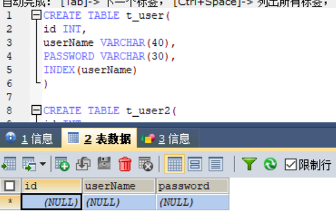

## 第一章 MySQL简介
* 1.1 MySQL简介
    * MySQL是一种关系型数据库管理系统，关系数据库将数据保存在不同的表中，而不是将所有数据放在一个大仓库内，这样就增加了速度并提高了灵活性。
* 1.2 MySQL安装与配置
* 1.3 sqlyog引入，非常方便，不用在命令提示符写一堆代码，可以直接在SQLyog创建并增删改查数据。

## 第二章 MySQL数据类型
* MySQL中定义数据字段的类型对数据库的优化是非常重要的。MySQL支持多种类型，大致可以分为三类：数值、日期/时间和字符串(字符)类型。
* 2.1 数值类型(整数类型、浮点数类型、定点数类型)
    * MySQL支持所有标准SQL数值数据类型。这些类型包括严格数值数据(整数)类型(INTEGER、SMALLINT、DECIMAL和NUMERIC)，以及近似数值数据(浮点数)类型(FLOAT、REAL和DOUBLE PRECISION)。
    * 关键字INT是INTEGER的同义词，关键词DEC是DECIMAL的同义词
    * 
* 2.2 日期类型、时间类型
    * 表示时间值的日期和事件的类型为DATETIME、DATE、TIMESTAMP、TIME和YEAR。每个时间类型有一个有效值范围和一个“零”值，当指定不合法的MySQL不能表示的值时使用“零”值。
        * 
    * TIMESTAMP类型有专有的自动更新特性。
* 2.3 字符串(字符)类型
    * 字符串类型指CHAR、VARCHAR、BINARY、VARBINARY、BLOB、TEXT、ENUM和SET。
    * CHAR 和 VARCHAR 类型相似，但保存和检索的方式不同，他们的最大长度和是否为不空格被保留等方面也不同，在存储或检索过程中不进行大小写转换，也就是存储的是大写，检索出来的肯定也是大写。
    * BINARY 和 VARBINARY 类似于 CHAR 和 VARCHAR，不同的是它们包含二进制字符串而不要非二进制字符串。也就是说，它们包含字节字符串而不是字符字符串。这说明它们没有字符集，并且排序和比较基于列值字节的数值。
    * BLOB 是一个二进制大对象，可以容纳可变数量的数据。有 4 种 BLOB 类型：TINYBLOB、BLOB、MEDIUMBLOB 和 LONGBLOB。它们区别在于可容纳存储范围不同。
    * TEXT类型有四种，TINYTEXT、TEXT、MEDIUMTEXT 和 LONGTEXT。对应的这 4 种 BLOB 类型，可存储的最大长度不同，可根据实际情况选择。常用的有TEXT和MEDIUMTEXT，TINYTEXT太小，LONGTEXT初学者用不到。
        * 

## 第三章 MySQL数据库和表的基本操作
* 3.1 数据库简介
    * 显而易见，就是存储数据的地方
* 3.2 数据库查看
    * 1. 首先，使用Win+R，cmd，```mysql -u root -p```，来连接数据库
    * 2. 其次，查看数据库的命令为 ```Show databases```
* 3.3 数据库创建
    * 创建数据库的命令 ```Create database db_test```。(格式要求：db->意为这是个数据库；test->数据库名)
* 3.4 数据库删除
    * 删除数据库命令 ```Drop database db_test```。

## 第四章 数据查询
* 4.1 单表查询
    * 1. 查询指定列，```SELECT t_student.name,t_student.age FROM t_student```
        * 
    * 2. 查询全部列，```SELECT * FROM t_student```
    * 3. 查询经过计算的值(想查询18岁以上的人)，```SELECT t_student.name,t_student.gender,t_student.age-10 FROM t_student```
        * 
    * 4. 消除取值重复的行，关键字为DISTINCT，```SELECT DISTINCT t_student.name FROM t_student```
        * 
    * 5. 查询满足条件的元祖(比较、确定范围、确定集合、字符匹配、空值、多重条件)
        * 
        * 
        * 
        * 
        * 空值，找一个值为空值的和不是空值的，关键字为第一个基础上```IS (NOT) NULL```
            * 
            * 
        * 
    * 6. Order by 子句(用来排序)
        * 
        * 
    * 7. 聚集函数
        * 
        * 
    * 8. Group by子句
        * 
* 4.2 连接查询
    * 1. 等值与非等值连接查询
        * 
    * 2. 自身连接
        * 
    * 3. 外连接
        * 左外连接，列出左边关系的所有元祖，我没能列出来，命令为```SELECT t_student.`name`,t_student.`age`,t_student.`gender`,t_score.`score` FROM t_score LEFT OUTER JOIN  t_student stu ON (t_score.`stu_id`=t_student.`id`)```
        * 右外连接，列出右边关系的所有元祖，命令为```SELECT t_student.`name`,t_student.`age`,t_student.`gender`,t_score.`score` FROM t_score RIGHT OUTER JOIN  t_student stu ON (t_score.`stu_id`=t_student.`id`)```
    * 4. 复合条件连接，查找score>90的学生，命令为```SELECT t_student.`name`,t_student.`age`,t_student.`gender`,t_score.`score` FROM t_score,t_student WHERE t_score.`stu_id`=t_student.`id` AND t_score.`score`>90```
        * 
* 4.3 嵌套查询
    * 1. 带有IN谓词的子查询
        * 
    * 2. 带有比较运算符的子查询
        * 
    * 3. 带有ANY(SOME)或者ALL谓词的子查询
        * 
        * 
    * 4. 带有EXISTS谓词的子查询，EXIST:代表存在量词，不会返回任何数据，只产生逻辑结果，就是true/false。其对应的反义谓词为 NOT EXIST，就是使用EXIST后返回什么，NOT EXIST就反着来。
        * 
        * 
* 4.4 集合查询
    * 1. UNION并集，列出符合age大于20的不管gender是否为男，并列出符合gender为男不管age是否大于20。
        * 
    * 2. INTERSECTS交集，MySQL中无法使用，也看不到运行结果，用到时再说，其实就是列出同时符合条件的数据。
        * ```SELECT * FROM t_student WHERE t_student.`age`>20 INTERSECTS SELECT * FROM t_student WHERE t_student.`gender`="男"```
    * 3. EXCEPT差集，就是列出符合条件的数据以外的数据，
* 4.5 SELECT语句的一般格式
    * ```
        SELECT[ALL|DISTINCT]<目标列表达式> [AS列名] [,<目标列表达式> [AS列名]...] 
        FROM <表明或视图名> [别名][,<表名或视图名>[别名]]... 
        WHERE <条件表达式> [AND|OR<条件表达式>...]
        [GROUP BY 列名[HAVING <条件表达式>]]
        [ORDER BY 列名[ASC|DESC]]
      ```

## 第五章 数据更新
* 5.1 插入数据，比较常用的是省略版和不想添加的数据写null版
    * 1. 普通插入，关键字为INTERT INTO ... VALUES ...
        * 
        * 
        * 
    * 2. 批量插入
        * 
* 5.2 修改数据，关键字为UPDATE ... SET ... (WHERE) ...
    * 
    * 
* 5.3 删除数据，关键字为DELETE FROM ... WHERE ...
    * 
    * 

## 第六章 索引
* 6.1 定义
    * 定义：索引是由数据库中一列或者多列组合而成，起作用时提高对表中数据的查询速度。
* 6.2 索引的优缺点
    * 优点：提高了查询数据的速度
    * 缺点：需要投入更多精力管理索引
* 6.3 索引的类别
    * 1. 普通索引，这类索引可以创建在任何数据类型中，VARCHAR,INT,BUBBLE中都可以创建。
        * 
    * 2. 唯一性索引，使用UNIQUE参数可以设置，再创建唯一性索引时，限制该索引的值必须是唯一的
        * 
    * 3. 全文索引，使用FULLTEXT参数可以设置，全文索引只能创建在CHAR,VARCHAR,TEXT类型的字段上，主要作用就是提高查询较大字符串类型的速度。但是MySQL引擎上默认不支持
    * 4. 单列索引，在表中可以给单个字段创建索引，单列索引可以是普通索引，也可以是唯一性索引，还可以是全文索引。
    * 5. 多列索引，是在表的多个字段上创建一个索引
        * 
    * 6. 空间索引，使用SPATIAL参数可以设置空间索引。空间索引只能建立在空间数据类型上，这样可以提高系统获取空间数据的效率；只有MylSAM引擎支持该索引，MySQL默认引擎不支持
* 6.4 索引的创建
    * ```
        CREATE TABLE 表名 (属性名 数据类型 [完整性约束条件],
        属性名 数据类型 [完整性约束条件],
        ... 属性名 数据类型
        [UNIQUE | FULLTEXT | SPATIAL | INDEX | KEY | 
        [别名] (属性名1 [(长度)] [ASC|DESC])]
        )
      ```
    * 1. 在已经存在的表上创建索引
        * ```
            CREATE [ UNIQUE | FULLTEXT | SPATIAL ] INDEX 索引名 ON 表名 (属性名 [(长度)] [ ASC | DESC])
          ```
        * 
    * 2. 用 ALERT TABLE 语句来创建索引
        * ```
            ALTER TABLE 表名 ADD [UNIQUE | FULLTEXT | SPATIAL] INDEX 索引名 (属性名 [(长度)] [ASC | DESC])
          ```
        * 
        * 
* 6.5 索引的删除
    * ```DROP INDEX 索引名 ON 表名 ```
    * 
    * 

## 第七章 视图
* 7.1 视图的定义
    * 定义：视图是指计算机数据库中的视图，是一个虚拟表，其内容由查询定义。同真实的表一样，视图包含一系列带有名称的列和行数据。但是试图并不在数据库中以存储的数据值集形式存在。行和列数据来自由定义视图的查询所引用的表，并且在引用视图时动态生成。
* 7.2 视图的作用
    * 1. 简化用户的操作
    * 2. 使用户能以多种角度看待同一数据
    * 3. 对重构数据库提供了一定程度的逻辑独立性
    * 4. 能够对机密数据提供安全保护
    * 5. 适当的利用视图可以更清晰的表达查询
* 7.3 创建视图与删除视图
    * 创建视图：单表视图、多表视图
        * 1. 单表视图
            * 
            * 
            * 
        * 2. 多表视图
            * 
* 7.4 查询视图
    * 
* 7.5 更新视图结构
    * 1. CREATE OR REPLACE VIEW，```CREATE OR REPLACE VIEW is_book AS SELECT t_book.`bookName` FROM t_book```
        * 
    * 2. ALTER，```ALTER VIEW is_book AS SELECT * FROM t_book```
        * 
* 7.6 视图数据更新
    * 1. 修改数据，```UPDATE is_book SET bookName='JS1' WHERE id=1```
        * 
    * 2. 上面代码基础上，```DELETE FROM is_book WHERE id=1```，删除表数据
        * 
    * 3. 插入数据，```INSERT INTO is_book VALUES(NULL,'MySQL','1')```
        * 

## 第八章 触发器
* 8.1 触发器的定义
    * 定义：处罚其实用户定义在关系表上的一类由事件驱动的特殊过程，一旦定义，任何用户对表的增删改操作均有服务器自动激活相应的触发器，在DBMS核心层(就是MySQL服务器系统)进行集中的完整性控制。
    * 但要注意，**慎用触发器！！！！**触发器功能强大，可以轻松可靠的实现许多复杂的功能。要注意慎用的原因是，触发器本身无过错，但若滥用会造成数据库及应用程序的维护困难。在数据库操作中，可以通过关系、触发器、存储过程、应用程序等来实现数据操作，同时规则、约束、缺省值也是保证数据完整性的重要保障。若对触发器过于依赖，势必影响数据库的结构，同时还会增加维护的复杂程度。
* 8.2 触发器的作用
    * 1. 触发器可以查询其他表，而且可以包含复杂的SQL语句。它们主要用于青志服从复杂的业务规则或要求。
    * 2. 触发器也可用于清汁饮用完整性，以便在多个表中添加、更新或删除行时，保留在这些表之间所定义的关系。
* 8.3 定义触发器
    * ```
        CREATE TRIGGER `<databaseName>`.`triggerName` <[BEFORE | AFTER]> <[INSERT | UPDATE | DELETE]> ON [dbo] <TABLEnAME> 
        FOR EACH ROW
        BEGIN
        --do something
        END
      ``` 
        * 创建一个触发器，设置一个触发器的名称，也可以带一个数据库名称的前缀。before和after指的是，是决定在INSERT | UPDATE | DELETE语句之前还是之后执行这个触发器内容的。跟上关键字ON，dbo代表该表的所有者/管理员，后面跟上表名。FOR EACH ROW代表行级触发器。BEGIN和END这两个关键字之间写的就是触发器要执行的内容，但如果内容只有一行的话，这两个关键字就不用写。
* 8.4 激活触发器
* 8.5 删除触发器